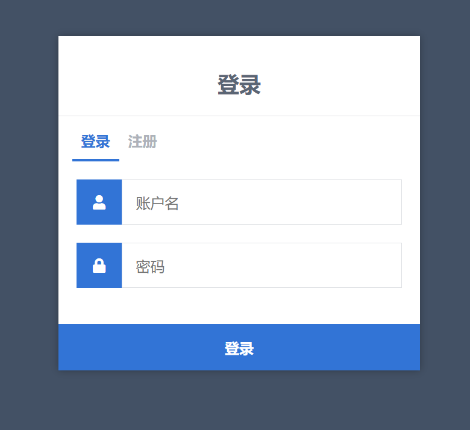
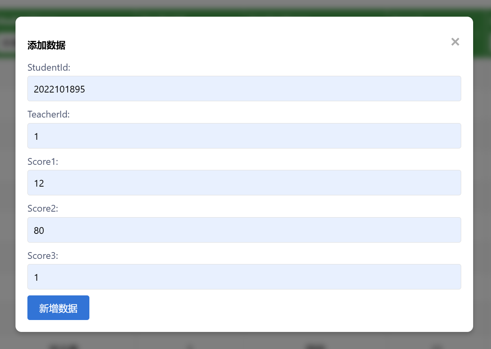

# 研究生复试打分系统

## 环境
python 3.10.7

## 运行
一、在目录下创建虚拟环境，并激活
```
conda create --name your_env_name python=3.10.7
conda activate your_env_name
```
二、安装依赖
```
pip install -r requirements.txt
```
三、运行
```
python main.py
```

## 实际使用
### 1. 注册
以下界面进行用户的注册，注意注册后默认用户权限为Worker，即打分的工作人员，只能够编辑复试笔试打分表和复试面试打分表。
注意：用户名不能和其他用户重复，且邮箱格式必须为xxx@xxx.xxx

### 2. 登录
登录界面，写入用户名和密码，点击登录按钮即可。

### 3. 首页
登录之后，以下就是主页界面。顶部导航栏可以切换到不同的页面，分别是当前的主页，个人信息，和登出账号。
左侧导航栏，分别是基础数据表和视图表，默认为基础数据表。基础数据表和视图表的区别在于，视图表的全部数据都不能够进行修改，只有查看的权限。


同时，我们可以看到中间的内容部分。上方的选择框可以选择在不同的表格中切换，加载表格按钮可以刷新表格。若此处还有新增数据，代表您的账号有权限修改该张表，点击后即可根据当前表来新增数据。
而下方的表格中，可以看见有到处Excel按钮，点击后，即可以导出当前所看见的表格。且Excel文件的名字为：当前表明+当前日期.xlsx


再看表中，上方一行是该表的表头，可以点击进行升序或者降序排列。而每列表头下方的下拉框点开，则是可以进行列的筛选。


接着右上角的搜索框，可以进行搜索，此处搜索的是整张表，即不管哪一列，只要包含搜索内容的行都会显示出来。还没有做成可以直接筛某一列的功能，后续会增加

注意：默认显示最大行数为50行，多的需要点击切换页面。
#### 3.1 基础数据表
##### 3.1.1 复试笔试打分表
老师只需要点击新增数据，以此输入学生的学号和分数，即可完成复试笔试打分。


注意（新增数据和修改数据同理）：
- 填写的学号必须是学生表中已有学生的学号，否则无法保存。

##### 3.1.2 复试面试打分表
老师只需要点击新增数据，以此输入学生的学号，老师的工号，以及该名老师在三个环节中打的分数，即可完成复试面试打分。



注意（新增数据和修改数据同理）：
- 填写的学号和工号必须是学生表，老师表中已有学生的学号和老师的工号，否则无法保存。
- 三个环节的打分目前没有设置范围。
- 填写的老师工号，必须是给学生进行面试的老师才能保存。
- 若已经填写过该老师对这个学生的打分记录，也无法进行保存。

##### 3.1.3 学院表
管理员可以新增学院


注意（新增数据和修改数据同理）：
- 学院的名称不可重复，会无法保存
##### 3.1.4 专业表
管理员可以新增专业


注意（新增数据和修改数据同理）：
- 这里的DepartmentName是在学院表中已有的学院名称，此处会以下拉框的形式呈现
- 专业名称不可重复，会无法保存

##### 3.1.5 学生表
管理员新增学生的信息，分别为：学号，姓名，性别，本科院校，联系方式，报考专业，当前状态，批次，初试分数，排班Id
- 性别是下拉框，可选男或女
- 报考专业会从转专业表中已有的专业形成下拉框
- 当前状态有：已报名，笔试完成，面试完成，已录取，未录取
  - 默认为已报名，表示学生已经报名参加复试
  - 当笔试分数打完后，将会将该学生状态设置为笔试完成
  - 当五个老师的面试分数都打完后，将会将该学生状态设置为面试完成
  - 最后已录取和未录取是由管理员自行手动修改的
- 批次指的是招生的批次，只能选择批次表中的批次
- 排班Id指的是学生面试的场次，只能选择在排班表中已有的排班Id


##### 3.1.6 教师表
管理员新增老师的信息，分别为：老师姓名，性别，所属学院，职称，联系方式，是否是政治老师
- 性别是下拉框，可选男或女
- 所属学院是下拉框，只能选择学院表中已有的学院
- 职称是下拉框，可选教授，副教授，讲师，助教
- 是否是政治老师，关乎到后续计算政治分的时候，默认为0即不是，1则为是


##### 3.1.7 用户表
管理员可以管理平台用户的信息，同时Worker权限的账号不能看见此表。需要注意的是，管理员可以在这里更改Worker账号的权限，从而来给给予他们管理员。
- Role即是权限，有Admin和Worker，Admin可以管理所有数据，而Worker则只能管理打分相关的数据
- 邮箱则一定需要是xxx@xxx.xxx的格式
- 用户名不能重复


##### 3.1.8 批次表
管理员可以添加批次信息


##### 3.1.9 排班表
管理员可以新增排班表
- 教室名字是下拉框，只能选择教室表中已有的教室名字
- 批次是下拉框，只能选择批次表中已有的批次
- 五个老师的id，其中第一个老师必须是政治老师
- 开始时间和结束时间的格式为：hh:mm
- 日期的格式为：yyyy-mm-dd
- 开始时间和结束时间不能违反常规，比如结束时间不能早于开始时间；同时不能跨越同一天
- 排班之间若教室和日期相同，则不同的排班间跨越的时间不能重叠


##### 3.1.10 权重表
管理员才能修改这里面的内容，其中权重表更像是个配置表。建议不要增点任何栏目，以及不要修改其中的权重名字。
- 有关权重的权重都是用来计算总分的
- 而通过分数是用来判断总分表中是否通过的标准的


##### 3.1.11 会场表
管理员可以新增会场信息


#### 3.2 视图表
##### 3.2.1 专业平均分表
此处可以看各种分数的平均


##### 3.2.2 总分表
此处可以看每个学生的所有分数详情，可以根据此表来筛选学生并进行录取。


##### 3.2.3 专业录取率表
此处可以看到各个专业在不同招生批次上的录取率


### 4. 个人信息
此处可以看到自己的账号和密码，邮箱，以及权限等信息。


## 代码详情
### 项目结构
- database: 数据库相关代码
  - createDataBase.sql: 数据库创建SQL文件
- images: Readme中使用的文件
- static: 静态库
  - js
    - studentData.js: 主页相关的js代码
    - view.js: 视图表相关的js代码
  - style.css: 样式文件
- templates: 模板文件
  - home.html: 主页
  - index.html: 登录页
  - layout.html: 主页的布局文件
  - profile.html: 个人信息页
  - register.html: 注册页
  - view.html: 视图表页
- utils: 工具类
  - query.py: 数据库查询相关的工具类
- config.py: 配置文件
- main.py: 主程序文件
- requirements.txt: 依赖文件
- README.md: 本文件
